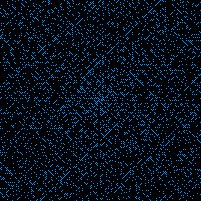

# Ulam Spiral Generator

## What is it?

It's the code behind [Ulam Spiral Generator](https://www.ulam-spiral.com). A small Java library, free of framework dependency. 

It computes [Ulam Spirals](https://en.wikipedia.org/wiki/Ulam_spiral) and generates their visual representations, where each pixel represents a single natural number.



In this example, blue pixels represent prime numbers, and black ones composite numbers.

## How does it work?

The library maps all natural numbers up to _N_ onto a 2-dimensional matrix representing an Ulam spiral. 
It then maps each number to true or false values (true being prime) resulting in a 2-dimensional boolean matrix.
Primality check is done via a lookup table created using the [Sieve of Eratosthenes](https://en.wikipedia.org/wiki/Sieve_of_Eratosthenes).

The prime map is then encoded into a .png image, as a visual representation of the spiral. Colors and sizes of the spiral are customizable.

### Prime distance filter
Additionally, the library supports filtering for primes with specific distance from each other. 
For example, `distance` filter set to 2 will result in only [Twin Primes](https://en.wikipedia.org/wiki/Twin_prime) being highlighted in the output image.

### Local density heatmap
Instead of flat two-color output, every pixel can be colored along a gradient based on how many primes are within a given radius around it.
Cells near dense prime clusters render closer to the prime color and sparser regions fade toward the composite color. 
For example, `densityRadius` parameter set to 3 counts primes within 3 cells of each number on the spiral.

### CSV export
It's also possible to export a spiral's prime map of given size to a .csv file (1s representing primes and 0s representing composite numbers). You can also easily
export ordered prime numbers returned by the sieve into a one-row .csv.

## Examples

A couple of example classes have been prepared to demonstrate how to work with the library. Each of them is 
a self-contained Java class with a runnable `main()` method. You will find them at `src/main/java/com/ulamspiral/generator/examples/`.

### Running the examples

Run from your IDE, or from the command line via the `exec-maven-plugin` (already wired up in the
`pom.xml`), which builds the classpath for you - no manual classpath wrangling needed:

**bash / Git Bash:**
```bash
./mvnw compile exec:java "-Dexec.mainClass=com.ulamspiral.generator.examples.BasicSpiralExample"
```

**Windows PowerShell:**
```powershell
.\mvnw.cmd compile exec:java "-Dexec.mainClass=com.ulamspiral.generator.examples.BasicSpiralExample"
```

The output file will be written to the `./generated-examples/` directory. 

#### Included examples:

- **`BasicSpiralExample`** - the smallest possible use of the library: builds a spiral, maps it to
  primality with trial division, renders it in flat two-color and exports a PNG image.
- **`DensitySpiralExample`** - a larger, sieve-backed spiral rendered as a local prime-density
  gradient instead of flat colors, with colors supplied as hex strings via `HexToRGBTranslator`.
- **`TwinPrimeGapSpiralExample`** - maps by prime *gaps* instead of plain primality
  (`SpiralMapper.toPrimeMapWithDistance`), so with `distance=2` it highlights twin primes.
- **`TwinPrimeDensitySpiralExample`** - combines the two above: twin-prime gap mapping, rendered as a
  density gradient so clusters of twin primes stand out as bright regions rather than individual dots.
- **`PrimeMapCsvExportExample`** - sieve-backed prime map written straight to a `.csv` file, then read back again.
- **`LargeSpiralExample`** - the correct way to handle a properly large spiral (5001x5001), using the prime sieve strategy
from the start for speed. 

### Tools

Additional tools you might find useful:

- `GeneratePrimeArrayUtil` - sieves primes up to _N_ and writes them to a `.csv` file in ascending order.
- `GeneratePrimeMapUtil` - computes an _N x N_ spiral and writes its prime map to a `.csv` file. Prime values are represented as 1s and composites as 0s in the output file.


## Build & test

You can run the tests and compile the project with the Maven wrapper:

```bash
./mvnw test      # compile + run the test suite (Spock/Groovy)
./mvnw clean install
```


## Package layout

- `prime` - spiral calculation, prime mapping, sieving
- `prime.check` - pluggable `PrimeChecker` strategies
- `image` - pixel rendering, (optional) density calculation and PNG export
- `image.hex` - hex color string parsing
- `csv` - CSV (de)serialization helpers
- `tools` - standalone `main()` utilities for producing CSV/PNG snapshots
- `examples` - standalone, runnable `main()` classes with usage examples


## Limitations

The library itself places no upper limit on spiral size (side length). `UlamSpiralCalculator` will attempt whatever
size you ask for. Two things actually determine what's possible:

**Spiral `size` up to 46,339.** 

This is the hard ceiling. Java arrays are indexed by `int`, and `PrimeSieve.primesUpTo`
sieves up to `size^2 (+ distance + 1)`. Once that exceeds `Integer.MAX_VALUE` (2,147,483,647),
`primesUpTo` method will throw `IllegalArgumentException` instead of silently truncating. 46,339 is the largest
*odd* spiral side size (spirals require an odd side length) whose square still fits. The next
odd size, 46,341, already exceeds this limit. Hence, **46,339 x 46,339 is the largest spiral theoretically possible to compute** with the current implementation. 

**Memory usage** 

This is the practical ceiling. `UlamSpiralCalculator` allocates a `long[size][size]` matrix (8 bytes per cell). At `size=5001` that's ~191 MB, comfortable for any modern machine. However, at the hard ceiling of 
`size=46,339`, the matrix alone needs ~16 GB, before the sieve's own `boolean[]` allocation or image rendering has started.
Reaching anywhere near the hard ceiling requires a large heap on a suitable machine. 
`-Xmx32g -Xms32g` is enough to compute a spiral and prime map near the 46,339 ceiling, but is not enough to also 
render it to a PNG - the pixel buffer needed for image export pushes well past that. Increase the heap allocation further if needed.

**Output image size**

Not really a ceiling but worth mentioning. Each pixel in the rendered image represents one natural number and PNG format is used because it's lossless. This works great for accuracy
and true representation of the spirals. However, this has the consequence of output images being rather large due to lack of aggressive compression that `.jpg` would bring.
5001x5001 render is already at ~2.7 MB and the output file size grows fast. Large .png files can be hard to view or work with. 

### Known edge case

`PrimeMapToImageMapper.createImageWithDensity` can render a solid black image, ignoring 
the requested prime/composite colors, when the prime map it receives has zero true cells. 
Every cell then has a density of 0, so the lookup table has exactly one entry, 
built from `0 / maxDensity`; when `maxDensity` is also 0 this divides to `NaN`, which casts to 0 
for every color channel - and that single black entry is what every pixel gets.

This requires all of the following at once:
- a distance-based prime map (`SpiralMapper.toPrimeMapWithDistance`) that happens to contain no
  qualifying cells at all - the plain (non-distance) prime map always contains small primes like 2, 3,
  5, 7, so it can never be all-false
- `size` at or near the spiral's minimum valid size - by size 5 there is consistently at least one
  qualifying cell
- an "unlucky" distance value - even at size 3, roughly 22% of the valid even distances (2 to 1000)
  produce an all-false map, for example 1000

Minimal repro: `size=3`, distance-mapped with `distance=1000`, rendered with any density radius.

## License

MIT License - see [LICENSE.txt](LICENSE.txt).
